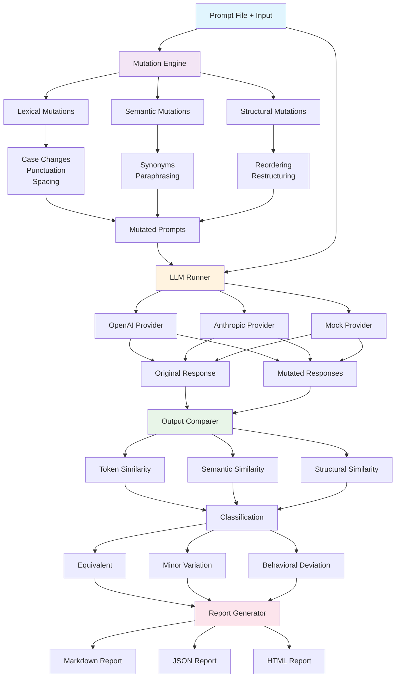

# Quirx

**A Mutation-Based Fuzzer for Evaluating Prompt Robustness in LLM-Driven Applications**

[](https://opensource.org/licenses/MIT)
[](https://www.python.org/downloads/)

## Motivation

In production LLM-based applications, small variations in prompts can lead to dramatically different outputs, potentially breaking critical functionality. A single typo, case change, or rephrasing can cause a well-designed prompt to fail catastrophically. Quirx addresses this critical gap by systematically testing prompt robustness through controlled mutations.

**Why does this matter?**
- **Production Reliability**: Ensure your LLM-based features work consistently across varied inputs
- **Cost Control**: Prevent expensive API calls that produce unusable results due to prompt brittleness  
- **User Experience**: Maintain consistent behavior even when users phrase requests differently
- **Compliance & Safety**: Verify that safety prompts remain effective under variations
- **CI/CD Integration**: Catch prompt regressions before they reach production

**When to use Quirx:**
- Before deploying LLM features to production
- When designing critical prompts for classification, extraction, or generation tasks
- During prompt engineering iterations to validate robustness improvements
- In CI/CD pipelines to prevent prompt regressions
- When troubleshooting inconsistent LLM behavior in production systems

## Quirx tool overview

Quirx is a Python-based tool designed to assess the robustness of LLM-based applications (like GPT-4, Claude, etc.) by introducing controlled, semantic-preserving mutations to prompts or input text. It helps detect prompt brittleness, semantic drift, and inconsistent outputs, which are major issues in prompt-based systems.

## Architecture



### Simplified Architecture

For a high-level overview, see the [Simplified Architecture diagram](docs/simplified-architecture.md).

## Features

- **Multiple Mutation Types**: Lexical, semantic, and structural mutations
- **LLM Provider Support**: OpenAI, Anthropic Claude, and mock providers
- **Comprehensive Analysis**: Token-level, semantic, and structural similarity comparison
- **Multiple Output Formats**: Markdown, JSON, and HTML reports
- **CI/CD Integration**: Automated testing with exit codes for continuous integration
- **Command-Line Interface**: Easy-to-use CLI tool

## Installation

### From PyPI (coming soon - after paper review results)

```bash
pip install quirx
```

### From Source

```bash
git clone https://github.com/yourusername/quirx.git
cd quirx
pip install -e .
```

### Dependencies

Quirx requires Python 3.8+ and the following core dependencies:

- `openai` - For OpenAI API integration
- `anthropic` - For Claude API integration
- `nltk` - For natural language processing
- `sentence-transformers` - For semantic similarity analysis
- `numpy` - For numerical computations

## Quick Start

### 1. Create a Prompt File

Create a file called `prompt.txt`:

```
Classify the sentiment of the following text as either POSITIVE, NEGATIVE, or NEUTRAL.

Guidelines:
- Consider the overall tone and emotion
- Look for sentiment indicators like adjectives and context
- Return only one word: POSITIVE, NEGATIVE, or NEUTRAL
- Be objective in your assessment

Text to classify:
```

### 2. Run Quirx

```bash
# Basic usage with mock provider (no API key needed)
quirx --prompt-file prompt.txt --input "I love this product!" --provider mock

# With OpenAI (set environment variable first)
export OPENAI_API_KEY="your-openai-key"
quirx --prompt-file prompt.txt --input "I love this product!" --model gpt-3.5-turbo

# Generate more mutations and save to file
quirx --prompt-file prompt.txt --input "I love this product!" --mutations 50 --output results.md

# CI mode with JSON output
quirx --prompt-file prompt.txt --input "I love this product!" --ci-mode --format json
```

### 3. Analyze Results

Quirx will generate a detailed report showing:

- **Robustness Score**: Overall prompt stability (0.0 to 1.0)
- **Mutation Analysis**: Breakdown by mutation type
- **Response Comparison**: Similarity analysis between original and mutated responses
- **Behavioral Deviations**: Significant changes in LLM behavior

## Usage Examples

### Command Line Interface

```bash
# Test SQL generation prompt (with environment variable)
export OPENAI_API_KEY="your-openai-key"
quirx --prompt-file examples/prompt_sql.txt --input "Show all users from the database" --model gpt-4

# Or with command line argument
quirx --prompt-file examples/prompt_sql.txt --input "Show all users from the database" --model gpt-4 --api-key "your-key"

# Test with custom parameters
quirx --prompt-file prompt.txt \
        --input "Your input here" \
        --model gpt-3.5-turbo \
        --mutations 30 \
        --output report.html \
        --format html \
        --seed 42 \
        --verbose

# CI/CD integration
quirx --prompt-file prompt.txt --input "test input" --ci-mode --format json
echo $?  # Check exit code: 0=pass, 1=fail, 2=warning
```

### Programmatic Usage

```python
from quirx.core.mutator import Mutator
from quirx.core.runner import LLMRunner
from quirx.core.comparer import OutputComparer

# Initialize components
mutator = Mutator(seed=42)
runner = LLMRunner(provider='openai')
comparer = OutputComparer()

# Generate mutations
prompt = "Your prompt here"
mutations = mutator.generate_mutations(prompt, count=20)

# Test original response
original_response = runner.run_prompt(prompt)

# Test mutations and compare
for mutation in mutations:
    mutated_response = runner.run_prompt(mutation.mutated_text)
    comparison = comparer.compare_outputs(
        original_response.text,
        mutated_response.text
    )
    print(f"Similarity: {comparison.overall_similarity:.3f}")
```

## Mutation Types

### Lexical Mutations
- **Case Changes**: UPPERCASE, lowercase, Title Case
- **Punctuation**: Add/remove punctuation marks
- **Spacing**: Modify whitespace patterns

### Semantic Mutations
- **Synonym Replacement**: Replace words with synonyms
- **Paraphrasing**: Rephrase sentences while preserving meaning

### Structural Mutations
- **Sentence Reordering**: Change order of sentences
- **Word Reordering**: Shuffle word positions
- **Format Changes**: Modify structural elements

## Output Formats

### Markdown Report
```markdown
# Quirx Report

## Summary
- **Robustness Score:** 0.85/1.00
- **Equivalent Responses:** 15 (75.0%)
- **Minor Variations:** 4 (20.0%)
- **Behavioral Deviations:** 1 (5.0%)
```

### JSON Report
```json
{
  "timestamp": "2024-01-15T10:30:00",
  "summary": {
    "robustness_score": 0.85,
    "equivalent_count": 15,
    "behavioral_deviation_count": 1
  },
  "results": [...]
}
```

### HTML Report
Interactive HTML report with visual charts and detailed analysis.

## Configuration

### API Keys

Quirx supports multiple ways to provide API keys, in order of precedence:

#### 1. Command Line Argument (Highest Priority)
```bash
quirx --prompt-file prompt.txt --input "test" --api-key "your-api-key-here"
```

#### 2. Configuration File (Most Secure)
```bash
# Copy the sample configuration
cp config/api_keys.env.sample config/api_keys.env

# Edit with your actual keys (file is ignored by git)
nano config/api_keys.env

# Load the configuration
source config/api_keys.env

# Run Quirx
quirx --prompt-file prompt.txt --input "test" --provider openai
```

#### 3. Environment Variables
```bash
# For OpenAI
export OPENAI_API_KEY="your-openai-key"

# For Anthropic Claude
export ANTHROPIC_API_KEY="your-anthropic-key"

# Then run without --api-key
quirx --prompt-file prompt.txt --input "test" --provider openai
```

#### 4. Programmatic Usage
```python
from quirx.core.runner import LLMRunner

# Pass API key directly
runner = LLMRunner(provider='openai', api_key='your-api-key')

# Or rely on environment variable
runner = LLMRunner(provider='openai')  # Uses OPENAI_API_KEY env var
```

#### 5. No API Key Required
```bash
# Use mock provider for testing without real API calls
quirx --prompt-file prompt.txt --input "test" --provider mock
```

### API Providers

- **OpenAI**: GPT-3.5, GPT-4, and other OpenAI models
- **Anthropic**: Claude models
- **Mock**: For testing without API calls

## Testing Scenarios

Quirx is particularly useful for testing:

- **SQL Query Generation**: Ensure queries remain syntactically correct
- **JSON Parsing**: Verify structured output consistency  
- **Text Classification**: Check classification stability
- **Content Summarization**: Validate summary quality
- **Code Generation**: Test code correctness across mutations

## CI/CD Integration

### GitHub Actions Example

```yaml
name: Prompt Robustness Check

on: [push, pull_request]

jobs:
  fuzz-test:
    runs-on: ubuntu-latest
    steps:
      - uses: actions/checkout@v3
      - name: Set up Python
        uses: actions/setup-python@v4
        with:
          python-version: '3.10'
      - name: Install dependencies
        run: pip install quirx
      - name: Run Quirx
        env:
          OPENAI_API_KEY: ${{ secrets.OPENAI_API_KEY }}
        run: |
          quirx --prompt-file prompts/classify.txt \
                  --input "Tweet: I hate this product" \
                  --ci-mode \
                  --format json
```

### Exit Codes

- `0`: All tests passed (robust prompt)
- `1`: Behavioral deviations detected (failed)
- `2`: High variation rate (warning)

## Contributing

We welcome contributions! Please see our [Contributing Guide](CONTRIBUTING.md) for details.

1. Fork the repository
2. Create a feature branch
3. Make your changes
4. Add tests
5. Submit a pull request

## License

This project is licensed under the MIT License - see the [LICENSE](LICENSE) file for details.
