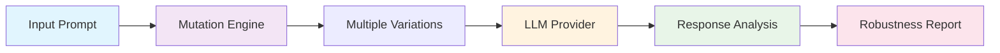

# LLMFuzz - Simplified Architecture

This document provides a high-level overview of how LLMFuzz works.

## Architecture Overview



## Process Flow

1. **Input**: You provide a prompt file and optional input text
2. **Mutation**: LLMFuzz generates variations of your prompt using three mutation types:
   - **Lexical**: Case changes, punctuation modifications
   - **Semantic**: Synonym replacements  
   - **Structural**: Sentence reordering
3. **Testing**: Each variation is sent to your chosen LLM provider (OpenAI, Anthropic, or Mock)
4. **Analysis**: Responses are compared using multiple similarity metrics
5. **Classification**: Each response is classified as:
   - **Equivalent**: Same meaning and behavior
   - **Minor Variation**: Slight differences, same intent
   - **Behavioral Deviation**: Significant changes that could cause issues
6. **Reporting**: Get detailed reports in Markdown, JSON, or HTML format

## Key Benefits

- **Automated Testing**: No manual prompt variations needed
- **Multiple Providers**: Works with OpenAI, Anthropic, or mock providers
- **Comprehensive Analysis**: Token, semantic, and structural similarity metrics
- **CI/CD Ready**: Exit codes for automated testing pipelines
- **Multiple Formats**: Choose from Markdown, JSON, or HTML reports

## Quick Example

```bash
# Test a classification prompt with 10 mutations
llmfuzz --prompt-file sentiment.txt --input "I love this!" --mutations 10

# Result: Robustness score of 0.85/1.0 with detailed breakdown
```

---

For the complete technical architecture, see the [main README](../README.md). 